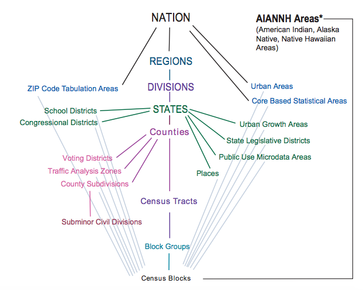
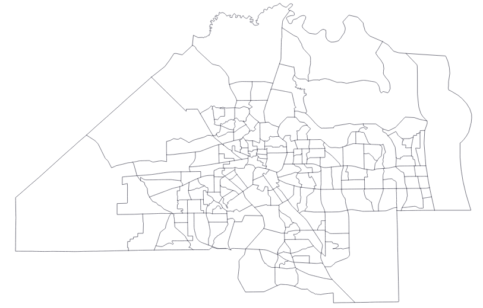
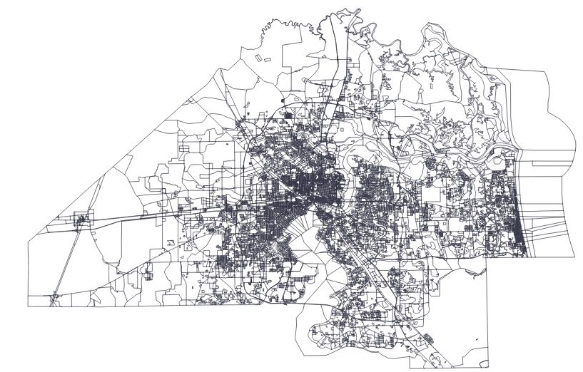
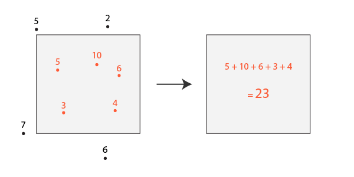
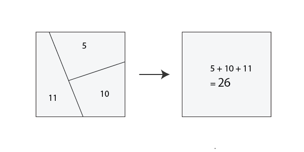
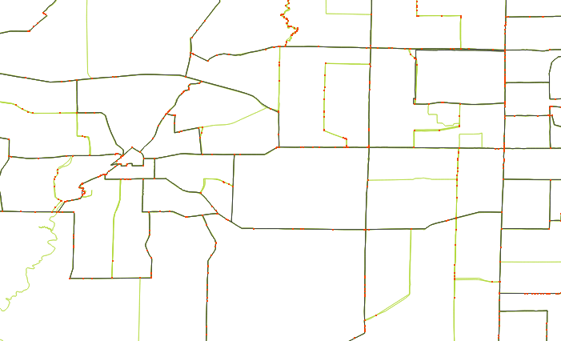

# Geographic data within your city

City averages gloss over a lot of important detail. Here are some tips for finding data and combining intra-city geographic data with the primary focus being on Census data.

# Finding local geographic data

### Local sources
Obviously a lot of local geographic data comes from local sources:
- Crime and police stats from police departments
- Ward- or precinct-level voting results from state or local governments
- Muni's have city maintenance records with addresses (e.g., street light and pothole repair times)
- Bunch of other stuff...

Can be manually intensive to collect (records requests, data cleaning, etc.) but this is often the more interesting data.

### Census
Census gives us local data on the characteristics of people and housing. Things like age, sex, race, poverty, employment, language spoken at home, educational attainment, homeownership, housing characteristics etc...

#### Hierarchy of Census geographies

#### The intra-city geographies

|    | Tracts | Block Groups | Blocks |
| ---| ------ | ------------ | ------ |
| Typical population | 2000 - 4000 | 800 - 1300 | 20 - 100 |
| Data availability | Most measures, long history | Many measures, shorter history | Few measures |
| |  |  |  |

### Census links:
- Places to start:
    - [Guidance for Data Users](https://www.census.gov/programs-surveys/acs/guidance.html) of the American Community Survey (ACS)
    - [Census Reporter](https://censusreporter.org/) is a really nice website for quickly finding data current data from the ACS. Gives quick summary visualizations down to the 
- Tabular data (i.e., spreadsheets)
    - [American Factfinder](https://factfinder.census.gov/faces/nav/jsf/pages/index.xhtml) is an interactive search tool (data for years 2000 - present)
    - [Developer APIs](https://www.census.gov/developers/) for when you want to download things programmatically (1990 - present)
    - [LTDB](https://s4.ad.brown.edu/projects/diversity/Researcher/Bridging.htm) lets you normalized old Census tract data to the 2010 borders
    - [IPUMS](https://usa.ipums.org/usa/) lets you compile all sorts of interesting statistics based on the underlying microdata
    - [NHGIS](https://www.nhgis.org/) has a good amount of data going way back, often at the tract-level (1790 - present)
- Geographic data (i.e., Shapefiles)
    - [Cartographic Boundary Shapefiles](https://www.census.gov/geo/maps-data/data/tiger-cart-boundary.html) (1992 - present)
    - [NHGIS](https://www.nhgis.org/) also has a lot of the historical Census boundaries going back to 1790

# Combining geographic data (AKA "spatial joining")

## Points to polygons

**Example**: 
You have all traffic stops in the city for a year (points) and you want to know the characteristics of the people in the neighborhoods where the most stops occur (polygons)

How to do it:
- [QGIS](http://www.qgistutorials.com/en/docs/performing_spatial_joins.html)
- Command line: [mapshaper](https://github.com/mbloch/mapshaper/wiki/Command-Reference#-join) or [ogr2ogr](https://github.com/dwtkns/gdal-cheat-sheet) (scroll to "Spatial join")

Geocoding--turning addresses into points: 
- [Google Geocoding API](https://developers.google.com/maps/documentation/geocoding/intro)
- [Mapbox Geocoding](https://www.mapbox.com/geocoding/)
- [Census Geocoder](https://geocoding.geo.census.gov/)

## Polygons to polygons

### If borders line up...

### ...dissolve

**Example**: Tracts are made up of block groups. In WI, three state assembly districts make a state senate district. Etc.

Spatial equivalent of SQL `GROUP BY` clause.

How to do it:
- [QGIS](https://plugins.qgis.org/plugins/DissolveWithStats/)
- Command line: [mapshaper](https://github.com/mbloch/mapshaper/wiki/Command-Reference#-dissolve) or [ogr2ogr](https://github.com/dwtkns/gdal-cheat-sheet) (scroll to "dissolve")

### If borders don't line up...

### ...join by intersections

A quick and dirty way of joining polygons to polygons is to say a set of polygons matches another if it (1) intersects it, (2) is contained within it, or (3) contains it. (See this [spatial joins example](http://geopandas.org/mergingdata.html#spatial-joins) using GeoPandas).

### ...interpolate 

Census tract borders change from decade to decade. This makes it hard to get a reliable time series for a given neighborhood. The [Longitudinal Tract Data Base (LTDB)](https://s4.ad.brown.edu/projects/diversity/Researcher/Bridging.htm) lets you take old Census tract data (as far back as 1970) and get estimates that line up with the 2010 Census tracts for all years.

#### Changes to tracts from 1970 (green) to 2010 (black)

The technique boils down to calculating how much the old polygons intersect with the new and then taking weighted averages using the area size and population as weights. One nice this with this is you can combine geographies that have fairly different borders like tracts, police districts, voting wards.

Caveat: You make some pretty big assumptions when use this technique--basically that the characteristics of the population are distributed evenly across the source geography. It really is an approximation.
